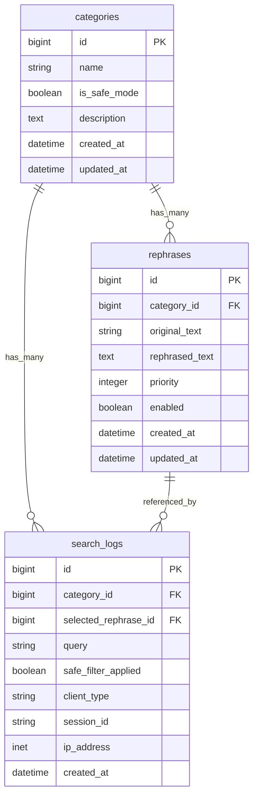

# データベース設計書（検索・言い換えエンジン）

- ベースブランチ: `main`
- 対象ブランチ: `feature/design-db-schema`
- 技術スタック: Rails 7.x / ActiveRecord / PostgreSQL
- 主要テーブル: `categories`, `rephrases`, `search_logs`

## 1. Entity Relationship Diagram (Text-based/Mermaid)

関係性:
- `Category has_many :rephrases`
- `Category has_many :search_logs`
- `Rephrase belongs_to :category`
- `SearchLog belongs_to :category, optional: true`
- `SearchLog belongs_to :selected_rephrase, class_name: "Rephrase", optional: true`

## 2. Table Definitions (Detail)

### categories

| Column | Type | Options (Null/Default/Index) | Description |
|---|---|---|---|
| id | bigint | PK | 主キー |
| name | string | `null: false`, `index: { unique: true }` | カテゴリ名（例: ビジネス、カジュアル） |
| is_safe_mode | boolean | `null: false`, `default: false`, `index: true` | セーフモード対象カテゴリか |
| description | text | `null: true` | カテゴリ説明 |
| created_at | datetime | `null: false` | 作成日時 |
| updated_at | datetime | `null: false` | 更新日時 |

制約:
- `name` はユニーク制約を付与（重複カテゴリ防止）

### rephrases

| Column | Type | Options (Null/Default/Index) | Description |
|---|---|---|---|
| id | bigint | PK | 主キー |
| category_id | bigint | `null: false`, `index: true`, `foreign_key` | 所属カテゴリ |
| original_text | string | `null: false`, `index: true` | 元の入力文（検索キー） |
| rephrased_text | text | `null: false` | 言い換え結果 |
| priority | integer | `null: false`, `default: 100`, `index: true` | 表示順（小さいほど優先） |
| enabled | boolean | `null: false`, `default: true`, `index: true` | 利用可否フラグ |
| created_at | datetime | `null: false` | 作成日時 |
| updated_at | datetime | `null: false` | 更新日時 |

推奨インデックス:
- 複合インデックス: `[:category_id, :original_text, :enabled, :priority]`
- ユニーク制約（重複防止）: `[:category_id, :original_text, :rephrased_text]`

### search_logs

| Column | Type | Options (Null/Default/Index) | Description |
|---|---|---|---|
| id | bigint | PK | 主キー |
| category_id | bigint | `null: true`, `index: true`, `foreign_key` | 利用カテゴリ（未分類入力を許容） |
| selected_rephrase_id | bigint | `null: true`, `index: true`, `foreign_key: { to_table: :rephrases }` | ユーザーが選んだ言い換え候補 |
| query | string | `null: false`, `index: true` | 検索語 |
| safe_filter_applied | boolean | `null: false`, `default: false`, `index: true` | セーフモードフィルタ適用有無 |
| client_type | string | `null: false`, `default: "web"` | クライアント種別（web/api等） |
| session_id | string | `null: true`, `index: true` | セッション識別子 |
| ip_address | inet | `null: true` | 送信元IP |
| created_at | datetime | `null: false`, `index: true` | 作成日時 |

備考:
- `updated_at` は不要（監査ログ性質のため追記のみ運用）

## 3. Implementation Notes（削除・順序・ロジック）

### 削除方針

- `Category -> Rephrase`: `dependent: :destroy`
  - マスタ削除時に子データを残すと整合性が崩れるため、物理削除を採用
- `Category -> SearchLog`: `dependent` は付けず、DB外部キーを `on_delete: :nullify`
  - 分析ログを保持するため、カテゴリ削除後もログ自体は残す
- `Rephrase -> SearchLog(selected_rephrase_id)`: `on_delete: :nullify`
  - 言い換え辞書更新時に過去ログを保持

論理削除:
- 初期リリースでは不要（`enabled` による公開制御で十分）
- 法規制や監査要件が発生した場合に `deleted_at` 導入を検討

### マイグレーション順序

1. `create_categories`
2. `create_rephrases`（`category_id` FK）
3. `create_search_logs`（`category_id` と `selected_rephrase_id` FK）
4. 各種複合インデックス・ユニーク制約追加（必要に応じて同migration内可）

理由:
- 親テーブル（`categories`）を先に作らないと FK が張れない
- `search_logs.selected_rephrase_id` は `rephrases` 作成後でないと参照不可

### 検索ロジック仕様（`is_safe_mode: true` 優先）

前提:
- 入力パラメータ `safe_mode`（boolean）で制御
- `safe_mode = true` のとき、`categories.is_safe_mode = true` のカテゴリのみ検索対象

挙動:
1. `safe_mode = true`
   - `Category.where(is_safe_mode: true)` に絞り込み
   - そのカテゴリに紐づく `enabled = true` の `rephrases` から候補返却
2. `safe_mode = false`
   - 全カテゴリを対象に `enabled = true` の `rephrases` を検索
3. 候補の並び順
   - `priority ASC, id ASC`
4. ログ記録
   - `search_logs.safe_filter_applied` に `safe_mode` を保存

実装イメージ（ActiveRecord）:
- `Rephrase.joins(:category).where(enabled: true).yield_self { |rel| safe_mode ? rel.where(categories: { is_safe_mode: true }) : rel }`

## 4. Future Scalability

### 「その他」自由入力保存への移行パス

目的:
- 既存カテゴリに合致しない入力を学習データとして活用

移行案:
1. `search_logs.category_id` は `null` を許容（現設計済み）
2. `search_logs` に `free_text_category`（string, null: true）を追加
3. 運用上有効になった自由入力を `categories` へ昇格し、バッチで再紐付け

### 判定ルール変更余地

- `categories.is_safe_mode` の二値判定から、将来的に以下へ拡張可能
  - `safety_level`（enum/int）: `safe/normal/restricted`
  - 外部判定API結果の保存カラム追加（例: `safety_source`, `safety_score`）
- 既存クエリは `where(categories: { is_safe_mode: true })` をサービス層に閉じ込め、条件式差し替え可能な実装にする

### 性能・運用面

- `search_logs` の増加に備え、月次パーティションまたは定期アーカイブを検討
- 頻出検索向けに `rephrases(original_text)` の正規化（小文字化・空白正規化）を導入余地として残す
